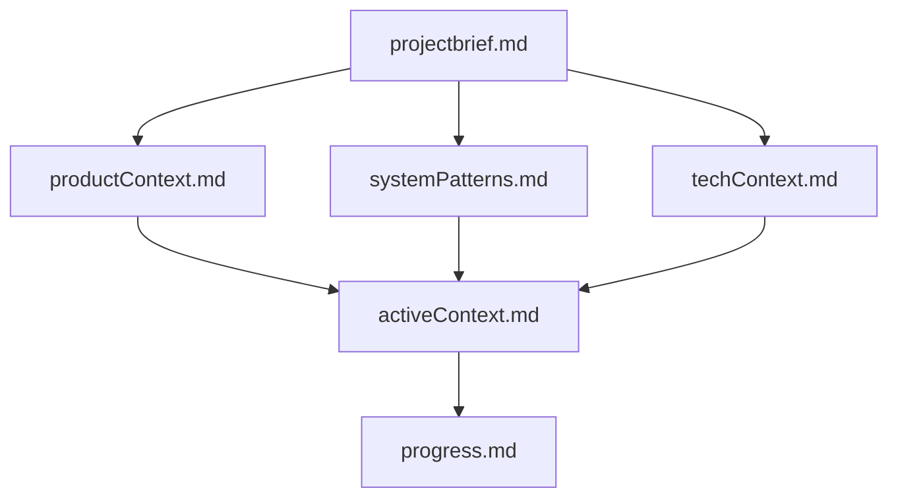

# Memory Bank for Claude AI

This Memory Bank implementation follows the structure outlined in [Cline Memory Bank](https://github.com/nickbaumann98/cline_docs/blob/main/prompting/custom%20instructions%20library/cline-memory-bank.md).

## Getting Started

1. Edit the files in the `DefaultProject` directory or create a new project directory
2. Fill in the project brief first, as it's the foundation document
3. Then fill in the other core files with your project information

## Core Files

The Memory Bank consists of these required core files in Markdown format:

1. `projectbrief.md` - Foundation document that shapes all other files
2. `productContext.md` - Why this project exists, problems it solves, etc.
3. `activeContext.md` - Current work focus, recent changes, next steps
4. `systemPatterns.md` - System architecture, key technical decisions
5. `techContext.md` - Technologies used, development setup
6. `progress.md` - What works, what's left to build, current status

Plus the `.clinerules` file which captures project intelligence.

## Working with Claude

Use these key commands with Claude:

* **"follow your custom instructions"** - Start a task, this will instruct Claude to read the context files and continue where he left off
* **"initialize memory bank"** - Start fresh
* **"update memory bank"** - Full documentation review

## Best Practices

* Use Plan mode for strategy discussions
* Use Act mode for implementation
* Let .clinerules evolve naturally
* Trust Claude's learning process
* Maintain the Memory Bank files regularly

## Memory Bank Structure

Remember that the Memory Bank is Claude's only link to previous work. Its effectiveness depends entirely on maintaining clear, accurate documentation.

## Claude Configuration

This repository includes a backup of the Claude configuration file that enables the Memory Bank MCP server.